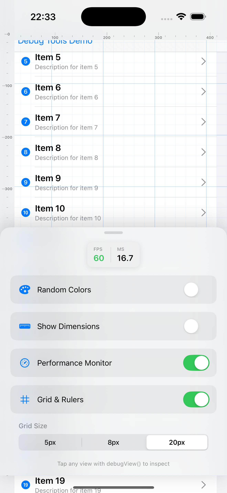
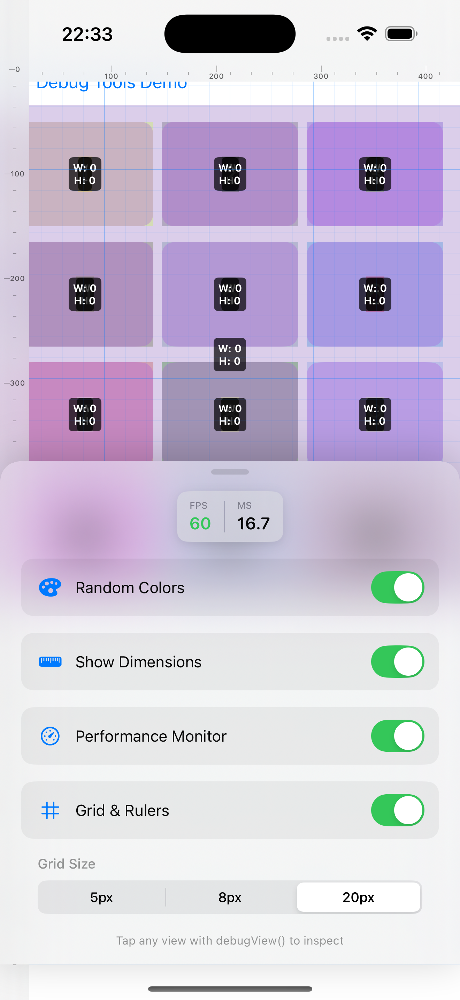

# SwiftUIDebugTools

A lightweight, Apple-designed debugging library for SwiftUI that helps you visualize layouts, inspect views, and monitor performance with an elegant bottom sheet interface.

## Screenshots

<p align="center">
  
  
  
</p>

## Features

- 🎨 **Random Colors**: Highlight all views with random background colors to visualize layout hierarchy
- 📏 **Dimensions**: Display width and height overlays on each view
- ⚡ **Performance Monitor**: Real-time FPS and frame time tracking with color-coded indicators
- 🔍 **Tap to Inspect**: Tap any view to see detailed size, position, and frame information
- 📐 **Grid & Rulers**: Minimalist Apple-style grid overlay with customizable spacing (5px, 8px, 20px)
- ⌨️ **Keyboard Shortcut**: Toggle with **⌘⇧D** in iOS Simulator
- 🎭 **Bottom Sheet UI**: Beautiful, non-intrusive interface that slides up from the bottom
- 🛡️ **Debug-only**: Zero overhead in release builds with `#if DEBUG`

## Installation

### Swift Package Manager

Add this to your `Package.swift`:
```swift
dependencies: [
    .package(url: "https://github.com/yourusername/SwiftUIDebugTools.git", from: "1.0.0")
]
```

Or in Xcode:
1. File → Add Package Dependencies
2. Paste the repository URL
3. Select version and click "Add Package"

## Usage

### Basic Setup
```swift
import SwiftUI
import SwiftUIDebugTools

@main
struct YourApp: App {
    var body: some Scene {
        WindowGroup {
            ContentView()
                .debugEnvironment() // Add this to enable debug tools!
        }
    }
}
```

### Mark Views for Debugging
```swift
struct ContentView: View {
    var body: some View {
        VStack {
            Text("Hello World")
                .debugView() // Add to any view you want to debug
            
            HStack {
                Rectangle()
                    .fill(Color.blue)
                    .frame(width: 100, height: 100)
                    .debugView()
                
                Rectangle()
                    .fill(Color.green)
                    .frame(width: 150, height: 80)
                    .debugView()
            }
            .debugView()
        }
        .debugView()
    }
}
```

### Toggle Debug Tools

#### In iOS Simulator
Press **⌘⇧D** (Command + Shift + D) to toggle the debug panel

#### On Physical Devices or Programmatically
```swift
// Add a button to toggle
Button("Toggle Debug Tools") {
    DebugManager.shared.toggle()
}

// Or call from anywhere in your code
DebugManager.shared.toggle()
```

### Customize Grid Size

The grid overlay supports three sizes:
- **5px** - Fine detail grid for precise alignment
- **8px** - Apple's standard 8-point grid system
- **20px** - Larger spacing for general layout

Change the grid size from the bottom sheet interface when "Grid & Rulers" is enabled.

## Features Overview

### 🎨 Random Colors
Automatically applies semi-transparent random colors to each view, making it easy to visualize layout boundaries and view hierarchy.

### 📏 Show Dimensions
Displays width and height measurements directly on each view with `.debugView()` modifier.

### ⚡ Performance Monitor
Real-time performance metrics displayed in a compact card:
- **FPS**: Color-coded (green ≥55, orange ≥30, red <30)
- **Frame Time**: Milliseconds per frame

### 🔍 Tap to Inspect
Tap any view with `.debugView()` to see:
- Size (width × height)
- Position (x, y coordinates)
- Frame (origin, width, height)
- Timestamp of inspection

### 📐 Grid & Rulers
Minimalist overlay with:
- Customizable grid spacing (5px, 8px, 20px)
- Top and left rulers with measurements
- Subtle, non-intrusive design
- Every 5th grid line emphasized for easy counting

## Example Project

Check out the example app in the `Example` folder to see all features in action:
```bash
cd Example/DebugToolsExample
open DebugToolsExample.xcodeproj
```

The example includes:
- Simple and complex layouts
- List and grid examples
- Animation performance testing
- Interactive demonstrations of all debug features

## Requirements

- iOS 15.0+ / macOS 12.0+
- Swift 5.9+
- Xcode 15.0+

## How It Works

SwiftUIDebugTools uses:
- **Preference Keys** for iOS 15+ compatible geometry tracking
- **CADisplayLink** for accurate performance monitoring
- **#if DEBUG** compilation to ensure zero overhead in release builds
- **#if targetEnvironment(simulator)** for simulator-specific keyboard shortcuts
- **UIViewRepresentable** for keyboard event handling

## API Reference

### Public Classes

#### `DebugManager`
The main singleton that manages debug state:
```swift
public class DebugManager: ObservableObject {
    public static let shared: DebugManager
    
    public var isVisible: Bool
    public var randomColorsEnabled: Bool
    public var showDimensionsEnabled: Bool
    public var showPerformanceEnabled: Bool
    public var showGridAndRulersEnabled: Bool
    public var gridSize: GridSize
    
    public func toggle()
}
```

#### `GridSize`
Enum for grid spacing options:
```swift
public enum GridSize: Int, CaseIterable {
    case small = 5   // 5px
    case medium = 8  // 8px
    case large = 20  // 20px
}
```

### View Modifiers
```swift
// Add debug capabilities to any view
func debugView() -> some View

// Enable debug environment (add to root view)
func debugEnvironment() -> some View
```

## Contributing

Contributions are welcome! Please feel free to submit a Pull Request.

## License

MIT License - feel free to use this in your projects!

## Author

Pau Ballada - [@pballada](https://github.com/pballada)

## Acknowledgments

- Inspired by Apple's design language and Xcode's debugging tools
- Built with SwiftUI's modern declarative syntax

---

**Note**: This library is only active in DEBUG builds. All debug code is stripped from release builds, ensuring zero performance impact in production.
